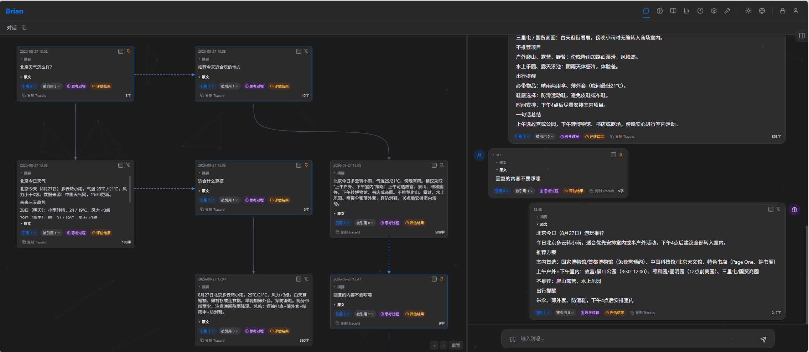
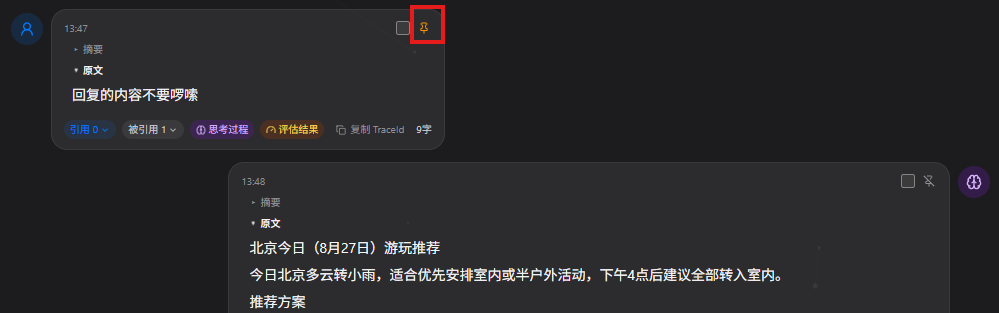
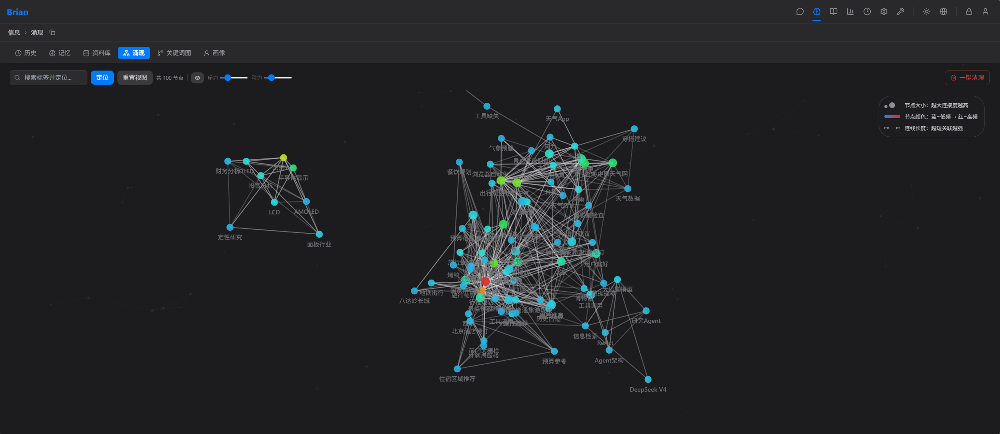
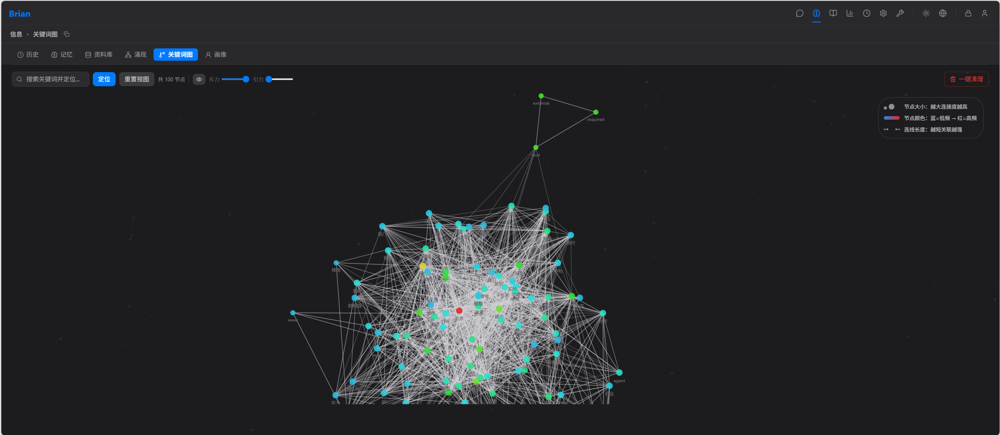

# Brian-Agent

面向 C 端用户的 C/S 架构 Agent 服务，核心理念是做"一个人"而非"一个工具"——具备记忆、自我反思、内在动力与成长进化能力。支持单机部署，也可改造为集中部署的 SaaS 服务。

## 快速开始

```bash

git clone 

# 安装依赖
npm install

# 启动后端 + 前端
./brian start

# 仅启动后端（端口 8000）
./brian start backend

# 仅启动前端（端口 5173）
npm run dev -w @brian-agent/frontend

# 构建
npm run build

# 运行测试
npm run test

# 类型检查
npm run typecheck
```

后端服务默认监听 `http://127.0.0.1:8000`，前端通过 Vite 代理转发 `/api` 和 `/ws` 请求。环境变量可通过 `BRIAN_PORT` 和 `BRIAN_HOST` 配置。

## 核心特性

### 1. ChatMap 可视化控制

只问答你关心的信息，摒弃无用的信息进入上下文；
上下文的构建只会采用引用的消息，不会去加载没有引用的消息，实现自主控制上下文；



### 2. Memory Pin 机制（强制模型注意力）

对话的论数过多，或者上下文太长，上下文可能会不加载或者忽略掉重要的信息，同步哦pin住消息，就可以让重要的信息，永远留在上下文的重要位置；



### 3. 涌现图与关键词图（提升 Memory 质量）

**信息页面**（`/info`）提供两个基于**共现关系**的知识图谱，帮助用户发现记忆中的隐藏关联：

#### 涌现图（Tag Graph）

基于时间线的信息大部分是重要的信息，但是因为上下文长度问题，可能会导致时间距离过远的信息损失，理解请求的内容，通过标签的形式通过图搜索，选中和当前请求最相关的信息；



#### 关键词图（Keyword Graph）

大脑中有些灵光一闪，就是被某一个词给激活的，通过关键词图的相关性搜索，来实现这样的灵光一闪；



这两个图的价值在于：**自动发现记忆中的涌现模式**——用户可能从未意识到的标签/关键词之间的关联被自动挖掘并可视化，帮助用户理解和审视自己的知识结构。同时，这些图谱关系也反向服务于上下文构建（`TAG_RELATIVE` 和 `KEYWORD` 维度），让模型在检索时不仅依赖向量相似度，还能利用**结构化的共现关系**，提升检索质量。

### 4. 随机记忆（增强 Memory 多样性）

设计理念：模拟人脑的**联想性/偶然性回忆**——有时最有价值的上下文恰恰来自看似无关的记忆。随机记忆防止上下文过于狭窄，为模型提供意外的灵感连接。
